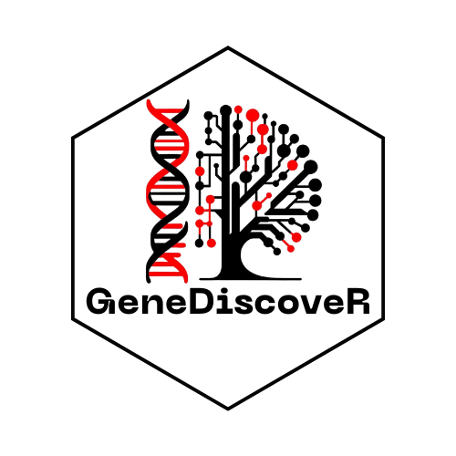
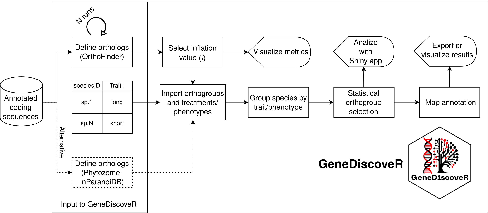

<!-- README.md is generated from README.Rmd. Please edit that file -->

```{r, include = FALSE}
knitr::opts_chunk$set(
    collapse = TRUE,
    comment = "#>",
    fig.path = "man/figures/README-",
    out.width = "100%"
)
```

# GeneDiscoveR 

<!-- badges: start -->
[](https://github.com/AtilioRausch/GeneDiscoveR/issues)
[](https://lifecycle.r-lib.org/articles/stages.html#stable)
<!-- badges: end -->

`GeneDiscoveR` enables the statistical association of the presence or absence of coding sequences 
with multiple treatments or phenotypes through the identification of orthologs/homologs from 
multiple tools.
To perform the association and identification, you can follow the steps indicated in the pipeline:

- **Prepare input files:** These can be the results of a run from OrthoFinder or, as recommended, 
multiple runs of [OrthoFinder](https://github.com/davidemms/OrthoFinder) varying the inflation parameter
 of the [MCScanX algorithm](https://doi.org/10.1093/nar/gkr1293), 
which allows for appropriate identification of orthogroups for species with 
significant evolutionary divergence, such as liverworts;
For this, scripts can be found in [/Python](https://github.com/AtilioRausch/GeneDiscoveR/tree/master/Python)
 and [/bash](https://github.com/AtilioRausch/GeneDiscoveR/tree/master/bash).
- **Import ortholog definitions and phenotype or treatment table:** From the ortholog definitions using OrthoFinder
 or [Phytozome-inParanoiDB](https://genome.jgi.doe.gov/portal/pages/dynamicOrganismDownload.jsf?organism=Phytozome) 
 and a table with species IDs and treatments or phenotypes, you can start the analyses with `GeneDiscoveR`;
- **Select the inflation value (I):** If you performed multiple runs of OrthoFinder, as recommended, you can select the inflation value that represents a balance between clustering and partitioning. Additionally, consider the root clade of the inferred species tree;
- **Group species by treatment or phenotype:** Define the phenotypes for subsequent statistical detection of orthogroups. The phenotypes are listed in the input information table; 
- **Statistical detection of orthogroups associated with a phenotype or treatment:** A statistical test is performed to evaluate the association of the presence or absence of each orthogroup with the treatments or phenotypes under study;
- **Annotation mapping, visualization, and export:** `GeneDiscoveR` allows functional annotation mapping and provides versatile visualizations, including a Shiny web app for visualization and analysis of the results. Additionally, results can be easily exported;

The pipeline of `GeneDiscoveR` is illustrated in the following figure.


## Installation instructions

Get the latest stable `R` release from [CRAN](http://cran.r-project.org/). Then install `GeneDiscoveR` from this repository using the following code:

```{r 'install', eval = FALSE}
# Install and import GeneDiscoveR package
invisible(lapply(c("usethis", "devtools"), library, character.only = TRUE))

devtools::install_github("AtilioRausch/GeneDiscoveR")

library(GeneDiscoveR)
```
## Examples of use

The following code shows an example of how to use `GeneDiscoveR`:

```{r 'create', eval = FALSE}
# Directory where the data is located
overallsDir <- system.file("extdata", "Comparatives-1dot3-6", package = "GeneDiscoveR")
N0sDir <- system.file("extdata", "N0-1dot3-6", package = "GeneDiscoveR")
dataFile <- system.file("extdata", "annotatedCDSs.tsv", package = "GeneDiscoveR")

# Create a GeneDiscoveR object
GeneDiscoveRobject <- GeneDiscoveR(
    overallsDir = overallsDir,
    N0sDir = N0sDir,
    dataFile = dataFile,
    minInflation = 1.3,
    maxInflation = 6,
    stepInflation = 0.1,
    orthologsTool = "OrthoFinder"
)
```
You can follow this example on [TPS-map](https://github.com/AtilioRausch/GeneDiscoveR/blob/master/examples/TPSmap.R), which shows the detection of orthogroups associated with different types of oil bodies in liverworts.
On the other hand, you can run the pipeline for plants with less divergence, such as Brassicaceae, on [Brassicaceae](https://github.com/AtilioRausch/GeneDiscoveR/blob/master/examples/Brassicaceae.R). 
Finally, if you have data from Phytozome-inParanoiDB, you can follow the example on [Phytozome-inParanoiDB](https://github.com/AtilioRausch/GeneDiscoveR/blob/master/examples/inparanoidb_phytozome.R).

## Citation

Below is the citation output from using `citation('GeneDiscoveR')` in R. Please
run this yourself to check for any updates on how to cite __GeneDiscoveR__.

```{r 'citation', eval = requireNamespace('GeneDiscoveR')}
print(citation("GeneDiscoveR"), bibtex = TRUE)
```

Please note that `GeneDiscoveR` was only made possible thanks to many other R and bioinformatics software authors.
`GeneDiscoveR` is waiting for publication, and we will provide the DOI as soon as possible.
